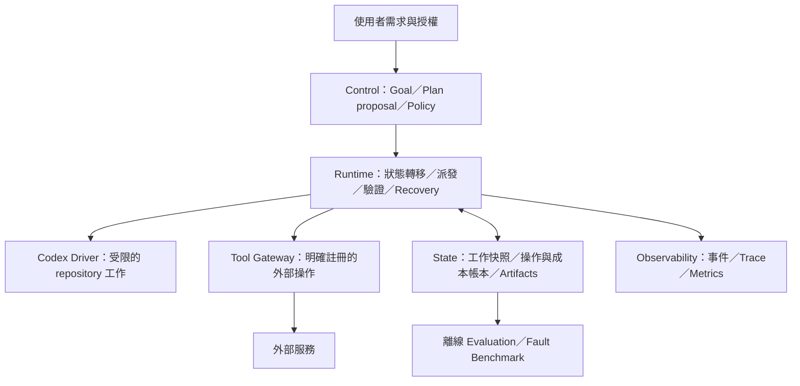
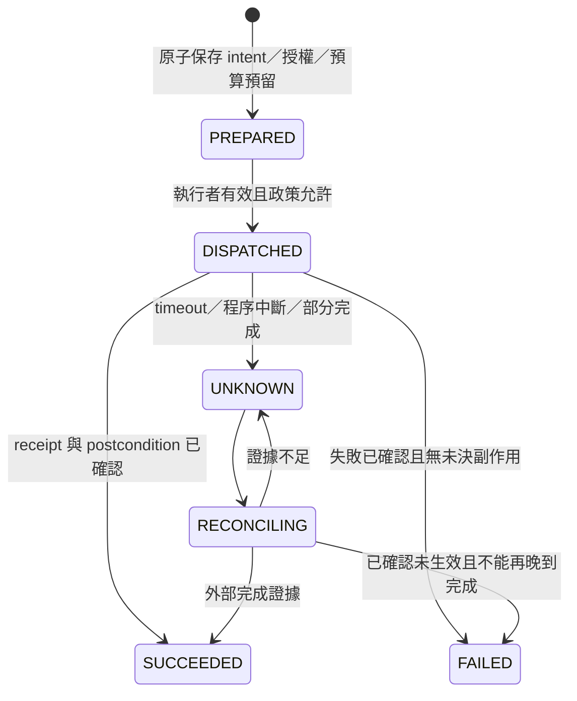

# Long-Running Agent Harness v2：架構與可靠性契約

日期：2026-09-09

狀態：**下一版設計提案；長任務能力尚未實作。**

實作基線：`9f04360`（Git evidence／effective contract 修正）。

配套：[分階段實作計畫](../plans/2026-09-09-long-running-harness-v2.md)。

## 1. 目的與文件關係

讓 Work 跨程序中斷、數小時至數週仍能保留目標、辨識已發生的操作、驗證產出並控制執行權。
可靠性由可持久化、可校驗的 harness 提供；模型只能提出 runtime 能拒絕的建議。

本文件把 2026-09-09 的 Long-Running AI Agent Architecture Review Draft 與 review 修正
落到現有 repo。保留 [MVP 設計](../../../agent-work-harness-design.md) 與
[既有決策](../../../DECISIONS.md) 作為歷史及目前行為說明，不將本提案倒寫成已完成能力。
原文件的「Harness 管 Work、不管 agent loop」仍適用於現有 Codex driver；
未來只有明確接入 Gateway 的操作，才宣稱具備逐工具治理。

成功不是「模型持續推理很久」，而是：

- 中斷後能說明哪個操作已完成、未開始或結果未知。
- 不重設已花費的資源，不遺忘已發生的副作用。
- 有足夠證據才宣告接受；能安全停止，並留下可處理的原因。
- 在相同任務與預算下，用故障注入證明恢復能力。

## 2. 現有能力與缺口

以下是基線原始碼觀察；缺口尚未全部經故障注入重現。

| 領域 | 基線能力／入口 | v2 缺口 |
|---|---|---|
| Goal／決策 | `src/types.ts` WorkContract；`Orchestrator.answer()` 新增版本並保留 message IDs | 沒有 milestone plan；現有 answer 不是通用 goal amendment API |
| Context | `context/manifest.ts`、`context/budget.ts`、`prompt/compiler.ts` | 字元裁切不是 token／費用帳本 |
| 判定 | `evidence/outcome.ts` fail-closed；不完整 Git observation 不得 SUCCESS | E3／E4、語意驗收仍未完整實作；見 evidence-model |
| Persistence | `trace/store.ts` SQLite WAL、events、artifacts | 多個 state／event 寫入未組成生命週期交易；無 schema migration runner |
| Snapshot | Attempt 保存 contractVersion 與 repository snapshot hash | repository snapshot 完整內容未作為 attempt 的持久化輸入 |
| Recovery | `markCrashedAttempts()`、`recover()` 不自動重跑模型 | CLI 每次啟動全域標記 RUNNING；recover 讀最新 contract／repo config |
| Ownership | `runAttempt()` 啟動單次 Codex | 無 durable ownership；不能保證多個 CLI 不互相干擾 |
| Driver | `runtime/codex-driver.ts` spawn、timeout、結果 protocol | 不攔截 Codex 內部每次工具呼叫；kill 直接 child 不等於已確認整個程序樹停止 |
| Artifact | 保存 prompt、diff、stdout 與 hash | readArtifact 未重新驗 hash；部分輸出缺少 attempt 的直接引用；無保留契約 |
| Trace | SQLite events.seq 決定順序 | 不是完整 event sourcing，也不是 OpenTelemetry trace |

基線驗證：2026-09-09，主機環境 `npm run check` 通過，173 tests、0 failures、0 skips；
包含 lint、typecheck、test、deadcode。受限沙箱中的相同命令因 fixture 的
`spawnSync git EPERM` 失敗；這不是完整檢查通過的證據，主機結果另外取得。
本文件沒有宣稱已跑過 v2 故障測試。

## 3. 演進選擇

| 路徑 | 重用 | 代價／風險 | 本次建議 |
|---|---|---|---|
| A. 先補本機恢復契約 | 現有 SQLite、Orchestrator、CodexDriver、EvidenceCollector | 初期小；不可直接宣稱分散式接手能力 | **下一個可交付範圍** |
| B. 導入 mature durable runtime | 既有判定與工具 adapter，將長流程交給 Temporal 等平台 | 中；需維運、版本策略、migration 與 replay 測試 | 跨主機／持久 timer 需求的候選 |
| C. 完整四區平台 | B 加 plan graph、Gateway、evaluation、跨任務知識 | 大；重複排程與雙重 state authority 風險最高 | 遠期參考，不一次建完 |

新能力依各階段前置條件以 P1–P5 gate 驗收。P1 保留零額外線上 LLM、不導入 workflow engine；
這不代表 A 已足以實現整份長任務規格。到 P4 選定一個 lifecycle owner，
不要讓自製 scheduler、Temporal、LangGraph 同時 retry 相同 operation。

## 4. 四個系統區域



Planner／Semantic Critic 是可替換的提議者，不持有寫入權、預算放行權或狀態轉移權。
Policy 的執行檢查必須位於 Runtime／Gateway；只在 Control Plane 畫一個方塊不構成 enforcement。
未經 Gateway 的任意 shell／網路寫入，不能納入「exactly once」或 compensation 保證。

## 5. Goal、Plan 與授權

每一版 goal contract 都不可覆寫，內容包括原始需求、限制、驗收條件及來源訊息。
使用者改需求時建立新版本，記錄 actor、source message、reason、差異与生效時間；
模型不得透過 replan 修改這些內容。

沿用 `Work.id` 作為使用者任務 identity，`WorkContract.version` 作為 goal／authority 契約版本。
不另外建立一份意義相同的 original_goal 字串作第二個 authority。
每個 plan 固定引用 contractVersion；新版 contract 不會偷偷改變執行中 attempt 的輸入。
執行時仍受最新的強制政策／撤權約束，舊版授權不能覆蓋新撤權。

Plan 保存：

```text
id, workId, version, parentPlanId, contractVersion, reason
changedStepIds, dependencyImpact, reusableArtifactIds
sourceCheckpointId, validationEvidenceIds, status
```

步驟使用穩定 ID 與明確 dependency；sequence 只決定展示順序。初期只需有序 milestones，
不預先建通用 DAG scheduler。每個 milestone 指向 acceptance criterion IDs。
Replan 先驗 schema、依賴、權限、預算與驗收覆蓋；語意判斷不能包裝成 deterministic proof。
通過後原子切換 active plan；過期 plan 的結果可留作證據，但不能覆蓋 active branch。

P2 將 Attempt 綁到 milestone，單一 milestone 的 SUCCESS 只完成該 milestone，
不直接把 Work 改成 DONE。Work 完成要求目前有效計畫的必要 milestones 與全域機械驗收
全部通過；P5 才在版本化完成政策中加入必要的語意 criterion。

## 6. Memory 是權威狀態的投影

拆成四類：

1. 工作狀態：contract／plan／目前 milestone／候選結果。
2. 不可回滾帳本：operation、receipt、費用、重試、撤權、取消與 recovery history。
3. 來源證據：使用者訊息、工具結果、引用文件、artifacts。
4. 跨 Work 知識：有來源、版本、有效期與刪除政策的偏好／事實；P1 不新增此系統。

聊天不是 workflow state，但原始需求與授權訊息仍須保留。
摘要不是 source of truth；decision log 保存結論、理由摘要與 evidence refs，不要求保存模型隱藏推理。

Context projection 必須帶 current contract、目前 plan／milestone、必要限制、
相關且未失效的 artifacts、近期決策及未決操作摘要。控制約束不可被預算裁切掉；
若必要控制內容本身超限，停止派發並回報 CONTEXT_BUDGET_EXCEEDED。
儲存觀察到的事實，不代表已證明外部世界永遠維持該狀態。

## 7. Checkpoint、resume、fork

Checkpoint 為 append-only 工作快照，包含 parent ID、branch ID、schema version、
contract／plan refs、artifact manifest、validation refs、created event sequence。
checkpoint 可標記 `pending_validation`，保存它不等於批准它。

| 動作 | 語意 |
|---|---|
| resume | 同一工作分支恢復未完成流程，重用已確認結果 |
| fork | 從舊快照建立新分支／plan，保留舊歷史 |
| audit replay | 用保存結果重建／檢查決策，不派發模型或外部寫入 |
| re-execution | 重新跑模型／工具，建立新 attempt，重新做政策與預算檢查 |

恢復演算法：

```text
讀取指定工作快照並驗 hash／schema
→ 讀最新不可回滾帳本與強制政策
→ 確認舊執行者與 pending operations 的狀態
→ 重新檢查依賴新鮮度與 artifact 可用性
→ 選擇 resume / fork / suspend
```

不得還原 spent、operation receipts、補償結果、全域 retry／replan 消耗或取消訊號。
既有 `preExistingDirty` 只有 path/hash，不是備份，不能用它恢復檔案。
P2 fork 預設只建立新工作分支；真正還原 repository 內容需要隔離 worktree 與完整 snapshot，
不能對使用者既有 worktree 執行 reset／clean 來冒充 checkpoint rollback。

## 8. Operation 與未知結果

Operation 是「一個邏輯業務意圖」，operation attempt 是「一次傳送／執行」。
ID 不綁 plan sequence；相同意圖跨 retry／replan 沿用 identity。

```text
operationId, workId, kind, adapterVersion, targetScope
canonicalInputHash, idempotencyKey, dedupeExpiresAt
precondition, reconciliationStrategy, compensationPolicy
effectType, retrySafety, reversibility, authorizationRef
```

能力維度分開記錄：read/write、idempotent/deduplicated/unsafe、
compensable/irreversible、reconciliation supported/unsupported。
Runtime 強制 adapter 宣告能力；不能要求所有外部 API 都能撤銷。
冪等 key 必須配合外部服務或本地原子操作的語意才有效。



先保存 intent，再呼叫外部，再保存 receipt。transactional outbox 解決本地待辦不遺失，
不會把任意第三方 API 變成 exactly-once。
同 key 不同 payload 拒絕；key 過期後禁止直接假設可去重。
Eventually consistent 的「查不到」不足以判定未發生；
adapter 要考慮 provider 的完成窗口、查詢一致性與尚在途請求。
UNKNOWN 保持預留與阻擋重送，直到對帳成功或轉人工處理。

## 9. 補償與失敗處理

先停止新派發並處理 in-flight，再選 safe retry、等待、保留有效成果向前修復、
compensation 或人工介入。不能一律「失敗 → rollback → replan」。

Compensation 是獨立持久 workflow，引用原 operation，有自己的 attempts、receipt、
timeout 與預算。每一步可再次失敗或 UNKNOWN；順序依依賴與業務規則決定。
需有 resource identity／ownership／version precondition，不能刪掉已被別人接管的資源。
補償無法消除已付費用、已寄訊息或已洩漏資訊。

不可逆操作在必要驗收完成後才進入 commit gate。若原授權未涵蓋該操作，
要求針對確定 payload／target／有效期限的授權；已有有效授權則不重複詢問。
新撤權後能否做清理，要由獨立 recovery policy 決定，不得擅自放寬權限。

## 10. Ownership、取消與排程

P1 採同主機、同 state directory **單一執行者**，因 Codex HOME／skills 也共用。
只讀 CLI 不執行 crash recovery 或其他狀態變更。啟動 run/retry/recover 前取得互斥執行權；
僅在確認原執行者與子程序已停止後才能接手。不提供依 timeout 自動奪鎖。
owner 無法確認時回報 OWNER_UNKNOWN，保留鎖與現況。

P4 才加入 durable queue、heartbeat、deadline、lease 與 execution epoch。
任何狀態提交或 Gateway 派發都需驗 epoch；lease 到期不等於舊程序已停止。
對過期但已送出的請求仍要 reconciliation。舊 worker 對本地檔案的任意寫入
不能只靠 DB fencing 阻止，需隔離 workspace 與發布 gate。

取消使用 CANCEL_REQUESTED → QUIESCING → CANCELLED；
最後一個狀態要求 in-flight 與清理責任已處置。未解決時保持 RECONCILING／WAITING_USER。
外部 callbacks 使用 event ID 去重與狀態版本檢查，處理重複、延遲、亂序。
WAITING_EXTERNAL／RETRY_WAIT 由持久 timer 喚醒，不用長時間占用模型或 worker。

## 11. 預算與重試

預算至少分派發次數、token、費用、wall-clock deadline、工具資源費用；
原有 promptBudgetChars 只屬 context 限制。

```text
spent + reserved + next_call_upper_bound <= limit
```

預留、operation intent、派發資格在一個本地 transaction 決定。
成功或失敗後按實際 receipt 結算；結果未知不能直接釋放全部預留。
費用用明確幣別與整數最小計價單位，保存 pricing version，不用浮點數累加。
Planner／Critic／工具與補償都計費；recovery reserve 包含在授權總額內。
沒有可驗證 usage／上界的 driver 必須標記 unknown／estimated，不能宣稱硬性美元預算。
無上界的操作在要求 hard cost cap 的 Work 中不派發。

retry 使用 bounded exponential backoff + jitter，遵守 rate-limit／Retry-After。
只有 transient 且安全的操作能自動 retry；由單一層擁有 retry policy，
避免 SDK、adapter、orchestrator 次數相乘。run／plan／step 各自上限，fork 不重設總額。
無進展偵測以重複錯誤、未新增可驗收證據等訊號輔助；LLM 分數不作唯一依據。
建立持續付費資源時一併記錄租期、owner、清理 deadline 與無法清理的告警。

## 12. Validation、Critic 與完成語意

保留 E1 Integrity、E2 Completeness；E3 Independence、E4 Sufficiency 與
[Evidence 模型](../../evidence-model.md) 對齊，不因使用新框架就宣稱已解決。
Plan schema 正確、exit 0、hash 一致都只證明對應性質。

每條必要驗收輸出：

```json
{
  "criterionId": "AC-LOGIN-01",
  "verdict": "unknown",
  "evidenceIds": [],
  "artifactManifestHash": "sha256-of-the-candidate-manifest",
  "validatorVersion": "login-e2e-v1",
  "reasonCode": "DEPENDENCY_UNAVAILABLE"
}
```

必要條件 fail 或 unknown 不得 DONE。評估固定引用候選 artifact 版本；
驗收後內容變動立即使相關 verdict 失效。硬限制失敗不能被平均分數抵銷。
Semantic critic 可以 abstain；保存 criterion-level 理由與證據，不採信未校準分數是機率。
高風險項目使用獨立測試或指定 reviewer；多模型投票不能保證正確。

Critic 事件：milestone 完成、plan 變更、重複 failure、依賴失效、無進展、
異常成本、不可逆操作前與最終驗收。保留週期保底；
以 event 去重、冷卻、評估預算限制避免故障風暴。硬 policy checks 每次必要邊界必跑。

P1 的 SUCCESS 維持既有 mechanical outcome 語意，不改稱「全域使用者目標已獨立證明」。
P5 加入必要 criterion verdict 與更完整完成契約時，須版本化 outcome policy。

## 13. 錯誤與 Recovery Policy

錯誤保存 code、phase、operation/attempt identity、retryability、effect outcome、
scope、evidence refs；不要把 business failure、delivery uncertainty 與 evaluator 不確定混在一起。

| Code／條件 | 預設處置 |
|---|---|
| TOOL_TRANSIENT，確認 retry-safe | bounded retry／backoff |
| OUTCOME_UNKNOWN／PARTIAL_EFFECT | reconciliation，禁止盲目重送 |
| AUTH_EXPIRED | 等待更新憑證，重驗授權，不循環呼叫 |
| POLICY_DENIED／CONSTRAINT_VIOLATION | 停新派發，處理未決操作；不讓 replan 自行擴權 |
| STATE_CONFLICT／LEASE_LOST | 拒絕舊結果提交，交由有效 owner 對帳 |
| OWNER_UNKNOWN | 暫停接手，需證明舊程序已停止 |
| ARTIFACT_MISSING／ARTIFACT_CORRUPT | 阻擋受影響恢復／驗收；從可信備份恢復或重做 |
| SNAPSHOT_UNAVAILABLE／SCHEMA_UNSUPPORTED | 不用最新設定代替舊輸入；人工處理或相容 migration |
| VALIDATION_INCONCLUSIVE／DEPENDENCY_CHANGED | 刷新證據或重新規劃，不宣告成功 |
| GOAL_DRIFT／PLAN_INVALID | 停分支、保留帳本、受控 replan |
| RESOURCE_EXHAUSTED／RETRY_EXHAUSTED | suspend／失敗，依既定政策處理清理責任 |
| COMPENSATION_FAILED | 持久化補償進度，告警／人工處理 |

回傳空資料／零筆是工具契約的合法值或失敗，必須逐 adapter 定義。
nil、缺欄位、格式不符、輸出超限一律不能偽裝成「查無結果」。

## 14. 資料與交易邊界

沿用 works/contracts/attempts/messages/decisions/evidence/outcomes/events/artifacts。
按階段增加以下實體，不一次建空表：

| 階段 | 實體／資料 | 主要約束 |
|---|---|---|
| P1 | attempt input/output artifact refs、schema migrations、recovery session、execution ownership | 舊輸入不可覆寫；原子 terminal transition；owner 未確認不得接手 |
| P2 | plans、milestones、checkpoint、branch | unique(work, version)、固定 contractVersion、有效 dependency、可達 artifact refs |
| P3 | operations、operation_attempts、compensations、budget reservations/ledger | 同 identity 不同 payload 拒絕；預算原子預留；成本不回滾 |
| P4 | durable jobs／timer／inbox（由選定 runtime 擁有） | 唯一派發 identity、epoch 檢查、callback 去重 |
| P5 | criterion verdict、retention manifest、benchmark runs | verdict 綁 artifact／evaluator 版本；可恢復引用不可提前刪除 |

Transaction 只包短 DB 操作，不包 LLM、Git、verification 或網路 I/O。
建立完成 artifact 後再提交 DB 引用；crash 留下的無引用物件可日後 GC，
但 DB 不得指向尚未完整寫入的檔案。state transition、outcome 與對應 event 同 transaction。
SQLite WAL 不等於多個 SQL 自動組成一筆 transaction。

P1 不全面 event sourcing。Events 是不可覆寫的稽核紀錄，mutable current state 是讀寫模型；
兩者透過 transaction 維持一致。真正採 event sourcing 時需明定 reducer、schema evolution、
snapshot rebuild 與 non-deterministic results 記錄，不再維護第二套可獨立派發的權威狀態。

## 15. Observability 與 replay

識別關係：Work → Plan/Branch → Milestone → Attempt → OperationAttempt/Validation。
Artifact、checkpoint 是被引用的實體；保存／讀取它們的動作才是 span。
保留原有 events.seq 作 DB 事件順序；同時間戳加 ID 只能提供穩定排序，不保證因果。

同一 trace 的操作共用 trace_id、各有 span_id。跨天與異步恢復可開新 trace，
用 span links、workId、operationId、causation event ID 串接。
Trace 可採樣；權威 operation／budget／recovery 紀錄不可依賴 sampled telemetry。
attempt runtime stdout/stderr/result 需有直接引用，不能只能掃 artifact 目錄猜歸屬。

Audit replay 僅讀已保存結果；記錄 runtime build、compiler、model/config、tool contract、
validator 版本與外部輸入。對模型重新發相同 prompt 不是 deterministic replay。
Replay 發現缺 artifact 或不支援版本時，回報不可重建，不自動呼叫工具補洞。

## 16. 跨週版本、保留與資料保護

- Snapshot／event schema 明確版本化；migration 先備份、transaction、驗證舊 run 可讀。
- 進行中的 run 使用相容程式或受控遷移；舊 runtime 不能默默讀新版 schema 後繼續寫。
- Tool result 記 observedAt、來源、ETag/version、有效期；歷史證據不等於可重用的最新事實。
- Artifact 使用完整 SHA-256 identity、原子發布、讀取驗 hash，需有備份與 restore drill。
- 活躍／可恢復 Work 的引用、未決 operation、compensation 證據不能 GC。
- 可恢復期限不得長於必要 artifact、receipt 與去重資料的可用期限；超期明示不可安全恢復。
- Provider 去重期限比 Work 短時，使用可查詢業務 identity 或在恢復時阻擋重送。
- 封存 Work 可另設較短 raw logs 保留期；metadata 與 payload 分開，保存刪除 tombstone。
- 敏感訊息／tool output 最小化、限制存取並做 redaction；不把 credentials 寫入事件或 traces。
- P1 不自動刪資料；P5 提供 GC dry-run、引用可達性檢查與刪除證據。

## 17. Benchmark 與告警

沿用 task completion、retry、plan mutation、artifact validity、goal drift、成本指標，
補充以下分母與觀測：

| 指標 | 定義 |
|---|---|
| false_accept_rate | 宣告接受但被獨立 oracle 判錯／所有宣告接受 |
| duplicate_effect_rate | 多於授權次數的外部效果／邏輯寫入 operations |
| unknown_resolution_rate | 在 SLA 內解決的 UNKNOWN／全部 UNKNOWN |
| recovery_success_rate | 保留 invariants 並達到預期終態／注入中斷的 runs |
| recovery_latency | 中斷至安全可繼續／明確停止的時間，p50/p95/p99 |
| budget_overrun_rate | 超過授權上限的 Work／全部 Work，另列 unknown cost |
| cancel_effect_count | 取消要求後仍完成的外部效果，區分先前已在途與違規新派發 |
| manual_intervention_rate | 需人工決定才能完成的 Work／全部 Work |
| evaluator_false_accept/reject | 與獨立標註集比較，按任務類型及 evaluator version 分組 |
| cost_per_accepted_work | 同批全部 runs（含失敗）總成本／獨立驗收接受的 Work |

報告 latency、費用、步數的分布；計畫修改與 rollback 次數不是越低越好。
固定任務集、budget、模型設定、故障 seed、oracle 與環境，才比較架構版本。
測試含 crash-before/after-commit、外部成功 receipt 遺失、舊 worker 復活、補償再次中斷、
callback 重複亂序、artifact 損壞、預算並行競爭、取消在途、schema 升級、撤權與惡意 context。

告警至少涵蓋長時間 UNKNOWN、補償卡住、owner 不明、成本逼近保留邊界、
artifact 缺失與未處理取消。每則包含 Work／operation identity、目前責任人及下一步，
不只記 stack trace。離線測試用 fake providers，不需實際寄信或建立付費資源。

## 18. Review 的 15 題決策索引

| 題目 | 決策／位置 |
|---|---|
| 1 Goal immutable | 每版不可改，使用者可正式 amend；§5 |
| 2 Controlled replanning | 允許，依賴／預算／授權驗證後生效；§5 |
| 3 Critic 組合 | deterministic 優先，semantic 可 abstain；§12 |
| 4 Append-only／fork | 快照不可覆寫；resume 不必 fork；§7 |
| 5 Idempotency／compensation | 強制宣告能力與限制，非強制假裝全可撤銷；§8–9 |
| 6 Memory／聊天 | structured state 控制流程，原文保留為來源；§6 |
| 7 Trace／replay | trace 不足以重播，分 audit 與重新執行；§15 |
| 8 Benchmark | 增未知結果、重複副作用、false accept 與尾端成本；§17 |
| 9 錯誤分類 | code + phase + retryability + effect outcome；§13 |
| 10 Event sourcing | P1 不全面採用；§14 |
| 11 Scheduler | 邏輯上唯一 owner，服務可不拆；§10 |
| 12 Durable runtime | P4 比較後選一個 lifecycle owner；§3、§19 |
| 13 Critic 觸發 | 事件為主、週期保底、去重限額；§12 |
| 14 Evaluator 誤判 | 獨立證據、unknown、版本、校準、必要人工；§12 |
| 15 長期保留 | compatibility、freshness、引用存活期與 GC；§16 |

## 19. 框架查核與選型邊界

以下依 2026-09-09 官方文件查核，屬設計參考，沒有在本 repo 安裝／驗證框架：

- [Temporal Activities](https://docs.temporal.io/activity-definition)：Activity 可能重跑；
  外部成功後尚未回報就 crash 的窗口仍需 adapter 冪等與對帳。
- [Temporal Workflow Definition](https://docs.temporal.io/workflow-definition)：workflow replay
  需 deterministic；LLM／API／DB 等外部互動置於 Activities。
- [Temporal Continue-As-New](https://docs.temporal.io/workflow-execution/continue-as-new)：
  分段 event history，Execution 的 Run ID 改變；業務 identity 與帳本須跨段延續。
- [LangGraph Persistence](https://docs.langchain.com/oss/python/langgraph/persistence)：
  checkpointer 與跨 thread store 分工；記憶體 saver 不保證程序重啟後保留資料。
- [LangGraph Time Travel](https://docs.langchain.com/oss/python/langgraph/use-time-travel)：
  指定 checkpoint 後的 nodes 會重新執行，包括 LLM／API；不是無副作用 audit replay。
- [OpenTelemetry Traces](https://opentelemetry.io/docs/concepts/signals/traces/)：
  trace／span identity 與異步 span links。
- [Compensating Transaction](https://learn.microsoft.com/en-us/azure/architecture/patterns/compensating-transaction)：
  補償可失敗，不一定回復原狀，需保存進度。
- [Event Sourcing](https://learn.microsoft.com/en-us/azure/architecture/patterns/event-sourcing)：
  可選擇性採用，須承擔事件版本與重建成本。

在現有 black-box CodexDriver 上，任何框架都不會自動取得內部工具治理或精確美元成本。
P3/P4 接入之前必須先證明 adapter capability 與 Gateway 無繞過路徑。
